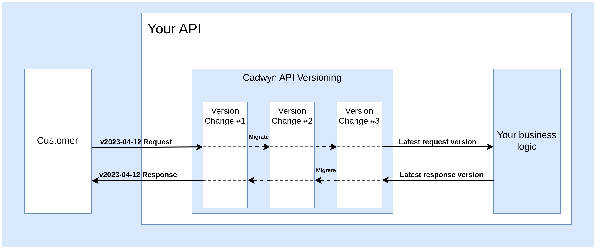

# Version Changes

Version changes are the backbone of Cadwyn. They give you an ability to describe things like "This field in that schema had a different name in an older version" or "this endpoint did not exist in all earlier versions".

In Cadwyn, your business logic always only works with a single version -- HEAD, which is essentially your representation of your latest version. This approach decouples your business logic from versioning and allows you to have hundreds of API versions using the same database models and business logic while also staying sane at the same time.

Whenever add a new version, you go through the following steps:

1. Make a breaking change in your HEAD version
2. Reverse it for all your older versions using special "migration instructions" so that your current users are not affected by the breaking changes

These migration instructions for reverting the breaking changes are gathered into groups to make them easier to maintain. Let's say that you want to rename the field "creation_date" into "created_at" but you also want to delete the endpoint "GET /v1/tax_ids": these changes are unrelated so they should be put into different groups. On the other hand, deletion of "POST /v1/tax_ids" endpoint should go into the same group as the deleetion of "GET /v1/tax_ids". These groups are very important to make the changes easily understandable for both your users and your developers.

Each such group is called a **version change**:

```python
# versions/v2023_02_10.py

from cadwyn import VersionChange, endpoint


class RemoveTaxIDEndpoints(VersionChange):
    description = "Remove `GET /v1/tax_ids` and `POST /v1/tax_ids` endpoints"
    instructions_to_migrate_to_previous_version = (
        endpoint("/v1/tax_ids", ["GET", "POST"]).existed,
    )
```

After you have described them, you add your version change class(es) into your version bundle to activate them:

```python
# versions/__init__.py

from cadwyn import VersionBundle, Version
from datetime import date

from .v2023_02_10 import RemoveTaxIDEndpoints


versions = VersionBundle(
    HeadVersion(),
    Version("2023-02-10"),
    RemoveTaxIDEndpoints,
    Version("2022-11-16"),
)
```

This instructs Cadwyn to **un**delete these endpoints in all versions older than 2023-02-10.

Now let's discuss what each of these parts does and why:

## VersionBundle

`VersionBundle` is your single source of truth for your list of versions. It contains your list of versions and all [version changes](#version-changes) associated with them. Each version change is a single group of breaking changes. Each `Version` contains a group of version changes that caused this version to be created. So for example, if I deleted an endpoint `POST /v1/tax_ids` in version `2023-02-10`, then I'll add the version change for deleting that endpoint into `2023-02-10`. For example:

```python
# versions/__init__.py

from cadwyn import VersionBundle, Version
from datetime import date

from .v2023_02_10 import RemoveTaxIDEndpoints


versions = VersionBundle(
    HeadVersion(),
    Version("2023-02-10"),
    RemoveTaxIDEndpoints,
    Version("2022-11-16"),
)
```

See how our first version, `2022-11-16` does not have any version changes? That is intentional! How can it have breaking changes if there are no versions before it?

## Version

`Version` is simply an ordered collection of version changes that allows you to describe when each version change happened so that Cadwyn is able to generate your schemas and routes for all versions correctly --  based on which version changes are located in which versions.

### HeadVersion

Cadwyn has a special HEAD version: it is the only version you will write by hand and use directly in your business logic. It is also the version that is used by Cadwyn for generating all other versions.

When handling an HTTP request, Cadwyn will first validate it with the appropriate API version, then Cadwyn will apply all converters from the request's API version and until the latest API version to it, and then finally Cadwyn will convert the request to the appropriate schema from HEAD (the schema that was used for generating the versioned schema from request's API version).

So Cadwyn will migrate all requests from all versions to HEAD version to make sure that your business logic knows about only one version.

HEAD is very similar to your latest version with a few key differences:

* Latest is user-facing while HEAD is only used internally by you and Cadwyn
* Latest is generated while HEAD is maintained by you by hand
* Latest only includes the fields that our user is supposed to see in the latest version while HEAD can include some fields missing from latest. For example, if an earlier version contained a field completely incompatible with latest -- HEAD will have it too to make sure that old versions can function same as before. This also applies to field types: if a field became required in latest but was nullable in an earlier version, then HEAD will have it as nullable to make sure that any earlier version request can easily be converted into a HEAD request
* Latest can include constraints that are incompatible with older versions while HEAD can contain no constraints at all if you want -- the user-facing schemas are used for validation before the request is converted to HEAD so HEAD does not need to re-validate anything if you do not want it to

## VersionChange

`VersionChange` classes describe each atomic group of business capabilities that you have altered in a version.

### VersionChange.\_\_name\_\_

The name of the version change, `RemoveTaxIDEndpoints`, describes what breaking change has happened. It must be a verb and it is the best resource for your new developers to quickly understand what happened between the versions. Do not be shy to use really long names -- it is better to have a long name than to create a misunderstanding. Avoid generic names such as `RefactorUserFields`. Better have an ugly name such as `RenameCreationDatetimeAndUpdateDatetimeToCreatedAtAndUpdatedAt` then to have a generic name such as `RefactorFields`. Because after just a few of such version changes, your versioning structure can become completely unreadable:

```python
versions = VersionBundle(
    Version("2023-05-09", ChangeCreateLogic, AddRequiredFields),
    Version("2023-04-02", DeleteEndpoint, ChangeFields, RenameFields),
    Version("2023-02-10", RenameEndpoints, RefactorFields),
    Version("2022-11-16"),
)
```

### VersionChange.description

The description field of your version change must be even more detailed. In fact, it is intended to be the **name** and the **summary** of the version change for your clients. It must clearly state to you clients **what happened** and **why**. So you need to make it grammatically correct, detailed, concrete, and written for humans. Note that you do not have to use a strict machine-readable format -- it is a portion of documentation, not a set of intructions. Let's take [Stripe's description](https://stripe.com/blog/api-versioning) to one of their version changes as an example:

```md
Event objects (and webhooks) will now render `request` subobject that contains a request ID and idempotency key instead of just a string request ID.
```

It is concise, descriptive, and human-readable -- just like any good documentation. Now let's look at the bad description:

```md
Migration from first version (2022-11-16) to 2023-09-01 version.
Changes:
* Changed schema for 'POST /v1/tax_ids' endpoint
```

* Its first line, `Migration from first version (2022-11-16) to 2023-09-01 version.`, duplicates the already-known information -- your developers will know which version `VersionChange` migrates to and from by its location in [VersionBundle](#versionbundle) and most likely by its file name. Your clients will also know that because you can automatically infer this information from  So it is simply standing in the way of actually useful parts of the documentation
* Its second line, `Changes:`, does not make any sense as well because description of a `VersionChange` cannot describe anything but changes. So again, it's stating the obvious and making it harder for our readers to understand the crux of the change
* Its third line, `Changed schema for 'POST /v1/tax_ids' endpoint`, gives both too much and too little information. First of all, it talks about changing schema but it never mentions what exactly changed. Remember: we are doing this to make it easy for our clients to migrate from one version to another. Insteaad, it is much better to mention the openapi model name that you changed, the fields you changed, and why you changed them

### VersionChange.instructions_to_migrate_to_previous_version

In Cadwyn, you use the latest version. This attribute is a way for you to describe how your schemas and endpoints looked in previous versions so that Cadwyn can guess schema and route generation to recreate the old schemas and endpoints for your clients. So you only need to maintain your head (latest) schemas and your migrations while Cadwyn takes care of the rest. In fact, you spend barely any effort on **maintaining** your migrations because they are effectively immutable -- they describe the breaking changes that happened in the past so there is no need to ever change them.

This approach of *maintaining the present and describing the past* might appear weird. You just need to form the correct mindset which is counter-intuitive at first but after just one or two attempts at versioning you will see how much sense this approach makes.

Imagine you needed to know what your code looked like two weeks ago. You would use `git checkout` or `git reset` with an older commit because `git` stores the latest version of your code (which is also called HEAD) and the diffs between it and each previous version as a chain of changes. This is exactly how Cadwyn works! We store the latest version and use the diffs to regenerate the older versions.

<details>
  <summary>Note to curious readers</summary>

  Git doesn't actually work this way internally. My description is closer to how SVN works. It's just a really simplistic metaphor to explain a concept.
</details>

### Data migrations

Let's say that we renamed the field `creation_date` into `created_at`. We have altered our schemas -- that's great! But when our clients send us requests using the old versions of our API -- we will still get the data where we have `creation_date` instead of `created_at`. How do we solve this? Well, in Cadwyn your business logic never receives requests of the old versions. Instead, it receives only the requests of the latest version. So when you define a version change that renames a field, you need to also define how to convert the request body from the old version to the newer version. For example:

```python
from cadwyn import (
    VersionChange,
    schema,
    convert_request_to_next_version_for,
)
from invoices import InvoiceCreateRequest


class RemoveTaxIDEndpoints(VersionChange):
    description = "Rename `Invoice.creation_date` into `Invoice.created_at`."
    instructions_to_migrate_to_previous_version = (
        schema(InvoiceCreateRequest)
        .field("creation_date")
        .had(name="created_at"),
    )

    @convert_request_to_next_version_for(InvoiceCreateRequest)
    def rename_creation_date_into_created_at(request: RequestInfo):
        request.body["created_at"] = request.body.pop("creation_date")
```

Notice how we specified the schema for `InvoiceCreateRequest` in our migration? This will signal to Cadwyn to apply it to all routes that have this schema as their body.

Now we have not only described how schemas changed but we have also described how to migrate a request of the old version to the new version. When Cadwyn receives a request of a particular version, the request is first validated against the schema of that particular version. Then Cadwyn applies all request migrations until the latest version to migrate the request to latest. So now your business logic receives the latest version of the request yet for your clients you have two versions of your API -- you have added variability without introducing any complexity into your business logic.

But wait.. What happens with the `Invoice` responses? Your business logic will now return `created_at` so your clients from old versions will be affected! Cadwyn has a tool for that too: we migrate our responses as well. Requests were migrated forward in versions but responses are migrated backward in versions! So your business logic returns a response of the latest version and Cadwyn will use your response migrations to migrate it back the version of your client's request:

```python
from cadwyn import (
    VersionChange,
    schema,
    convert_request_to_next_version_for,
    convert_response_to_previous_version_for,
)
from invoices import (
    BaseInvoice,
    InvoiceCreateRequest,
    InvoiceResource,
)


class RemoveTaxIDEndpoints(VersionChange):
    description = "Rename `Invoice.creation_date` into `Invoice.created_at`."
    instructions_to_migrate_to_previous_version = (
        schema(BaseInvoice).field("creation_date").had(name="created_at"),
    )

    @convert_request_to_next_version_for(InvoiceCreateRequest)
    def rename_creation_date_into_created_at(request: RequestInfo):
        request.body["created_at"] = request.body.pop("creation_date")

    @convert_response_to_previous_version_for(InvoiceResource)
    def rename_created_at_into_creation_date(response: ResponseInfo):
        response.body["creation_date"] = response.body.pop("created_at")
```

Notice how we specified the schema for `InvoiceResource` in our migration? This will signal to Cadwyn to apply it to all routes that have this schema as their `response_model`. Notice also that we now use `BaseInvoice` in our instructions -- let's imagine that it is the parent of both `InvoiceCreateRequest` and `InvoiceResource` so renaming it there will rename it in these schemas as well. You can, however, apply the instructions to both individual schemas instead of their parent if you want to.

Now our request comes, Cadwyn migrates it to the latest version using our request migration, then we do our business logic, return the latest response from it, and Cadwyn migrates it back to the request version. Does our business logic or database know about the fact that we have two versions? No, not at all! It is zero-cost. Imagine how beneficial it is when you support not two but two hundred versions.



**Notice** how we used the **latest** versions of our schemas in our migration -- this pattern can be found everywhere in Cadwyn. You use the latest version of your schemas to describe what happened to all other versions because other versions might not exist when you are defining migrations for them.

#### Path-based migration specification

Oftentimes you will need to migrate not based on the request body or response model but based on the path of the endpoint. This happens when, for example, endpoint does not have a request body or its response model is used in other places that we do not want to migrate. Let's pick the example [above](#data-migrations) and use paths instead of schemas:

```python
from cadwyn import (
    VersionChange,
    schema,
    convert_request_to_next_version_for,
    convert_response_to_previous_version_for,
)
from invoices import BaseInvoice


class RemoveTaxIDEndpoints(VersionChange):
    description = "Rename `Invoice.creation_date` into `Invoice.created_at`."
    instructions_to_migrate_to_previous_version = (
        schema(BaseInvoice).field("creation_date").had(name="created_at"),
    )

    @convert_request_to_next_version_for("/v1/invoices", ["POST"])
    def rename_creation_date_into_created_at(request: RequestInfo):
        request.body["created_at"] = request.body.pop("creation_date")

    @convert_response_to_previous_version_for("/v1/invoices", ["GET"])
    def rename_created_at_into_creation_date(response: ResponseInfo):
        response.body["creation_date"] = response.body.pop("created_at")
```

Though I highly recommend you to stick to schemas as it is much easier to introduce inconsistencies when using paths; for example, when you have 10 endpoints with the same response body schema but you forgot to add migrations for 3 of them because you use paths instead of schemas.

#### Migration of HTTP errors

Oftentimes you need to raise `fastapi.HTTPException` in your code to signal some errors to your users. However, if you want to change the status code of some error, it would be a breaking change because your error status codes and sometimes even their bodies are a part of your API contract.

By default, Cadwyn's response migrations do not handle errors but you can use the `migrate_http_errors` keyword argument to enable it:

```python
from cadwyn import (
    VersionChange,
    convert_response_to_previous_version_for,
)
from invoices import BaseInvoice


class RemoveTaxIDEndpoints(VersionChange):
    description = "Change status code in 'GET /v1/invoices' when invoice was not found from 400 to 404"
    instructions_to_migrate_to_previous_version = ()

    @convert_response_to_previous_version_for(
        "/v1/invoices", ["GET"], migrate_http_errors=True
    )
    def change_400_to_404(response: ResponseInfo):
        if response.status_code == 400:
            response.status_code = 404
```

#### Migration of non-body attributes

Cadwyn has an ability to migrate more than just request bodies.

`RequestInfo` has the the following interfaces to migrate requests:

* `body: Any`
* `headers: starlette.datastructures.MutableHeaders`
* `cookies: dict[str, str]`
* `query_params: dict[str, str]`

`ResponseInfo` has the the following interfaces to migrate responses:

* `body: Any`
* `status_code: int`
* `headers: starlette.datastructures.MutableHeaders`
* [set_cookie](https://www.starlette.io/responses/#set-cookie)
* [delete_cookie](https://www.starlette.io/responses/#delete-cookie)

#### Internal representations

We have only reviewed simplistic cases so far. But what happens when you cannot just migrate your data that easily? It can happen because your earlier versions had **more data** than your newer versions. Or that data had more formats.

Let's imagine that previously the `User` schema had a list of addresses but now we want to make a breaking change and turn them into a single address. The naive migration will just take the first address from the list for requests and turn that one address into a list for responses like so:

```python
from cadwyn import (
    VersionChange,
    schema,
    convert_request_to_next_version_for,
    convert_response_to_previous_version_for,
)
from users import BaseUser, UserCreateRequest, UserResource

# THIS IS AN EXAMPLE OF A BAD MIGRATION
class RemoveTaxIDEndpoints(VersionChange):
    description = "Users now have `address` field instead of `addresses`"
    instructions_to_migrate_to_previous_version = (
        schema(BaseUser).field("address").didnt_exist,
        schema(BaseUser).field("addresses").existed_as(type=list[str]),
    )

    @convert_request_to_next_version_for(BaseUser)
    def turn_addresses_into_a_single_item(request: RequestInfo):
        addresses = request.body.pop("addresses")
        # The list could have been empty in the past so new "address"
        # field must be nullable.
        request.body["address"] = addresses[0] if addresses else None

    @convert_response_to_previous_version_for(BaseUser)
    def turn_address_into_a_list(response: ResponseInfo):
        response.body["addresses"] = [response.body.pop("address")]
```

But this will not work. Now when the user from the old version asks us to save three addresses, we will in fact save only one. Old data is also going to be affected -- if old users had multiple addresses, we will only be able to return one of them. This is bad -- we have made a breaking change!

In order to solve this problem, Cadwyn uses a concept of **internal representations**. An internal representation of your data is like a database entry of your data -- it is its **latest** version plus all the fields that are incompatible with the latest API version. If we were talking about classes, then internal representation would be a child of your latest schemas -- it has all the same data and a little more, it expands its functionality. Essentially your internal representation of user object can contain much more data than your latest schemas.

So all your requests get migrated to HEAD, which is the internal representation of latest -- but not exactly the latest itself. So its data is really similar to latest. Same happens with your responses -- you do not respond with and migrate from the latest version of your data, you respond with its **internal representation** which is really close to the actual latest schemas.

In responses, returning the internal representation is simple: just return your database model or a dict with everything you need for all your versions. In the user address example, we would continue storing the list of addresses in our database but then add the single address to our response. Latest schemas will simply strip it but our older schemas will be able to use it!

```python
# in your business logic

return {"address": user.addresses[0] if user.addresses else None, **user}
```

So now your migration will look like the following:

```python
from cadwyn import VersionChange, schema
from users import User


class RemoveTaxIDEndpoints(VersionChange):
    description = "Users now have `address` field instead of `addresses`"
    instructions_to_migrate_to_previous_version = (
        schema(User).field("address").didnt_exist,
        schema(User).field("addresses").existed_as(type=list[str]),
    )
```

Yes, we do not need any of the migrations anymore because responses are handled automatically. See how-to section for an example of how we would achieve the same feat for requests.

#### Manual body migrations

Oftentimes you will have a need to migrate your data outside of routing, manually. For example, when you need to send a versioned response to your client via webhook or inside a worker/cronjob. In these instances, you can use `cadwyn.VersionBundle.migrate_response_body`:

```python
from users import UserResource
from versions import version_bundle

body_from_2000_01_01 = version_bundle.migrate_response_body(
    UserResource, latest_body={"name": "John"}, version=date(2000, 1, 1)
)
```

The returned `body_from_2000_01_01` is your data passed through all converters (similar to how it would when a response is returned from your route) and wrapped into `data.v2000_01_01.UserResource`. The fact that it is wrapped gives us the ability to include pydantic's defaults.

#### StreamingResponse and FileResponse migrations

Migrations for the bodies of `fastapi.responses.StreamingResponse` and `fastapi.responses.FileResponse` are not directly supported yet ([1](https://github.com/zmievsa/cadwyn/issues/125), [2](https://github.com/zmievsa/cadwyn/issues/126)). However, you can use `ResponseInfo._response` attribute to get access to the original `StreamingResponse` or `FileResponse` and modify it in any way you wish within your migrations.

## Pydantic RootModel migration warning

Pydantic has an interesting implementation detail: `pydantic.RootModel` instances are memoized. So the following code is going to output `True`:

```python
from users import User
from pydantic import RootModel

BulkCreateUsersRequestBody = RootModel[list[User]]
BulkCreateUsersResponseBody = RootModel[list[User]]

print(BulkCreateUsersRequestBody is BulkCreateUsersResponseBody)  # True
```

So if you make a migration that should only affect one of these schemas -- it will automatically affect both. A recommended alternative is to either use subclassing:

```python
from users import User
from pydantic import RootModel

UserList = RootModel[list[User]]


class BulkCreateUsersRequestBody(UserList):
    pass


class BulkCreateUsersResponseBody(UserList):
    pass


print(BulkCreateUsersRequestBody is BulkCreateUsersResponseBody)  # False
```

or to specify migrations using [endpoint path](#path-based-migration-specification) instead of a schema.

## Version changes with side effects

Sometimes you will use API versioning to handle a breaking change in your **business logic**, not in the schemas themselves. In such cases, it is tempting to add a version check and just follow the new business logic such as:

```python
if api_version_var.get() >= date(2022, 11, 11):
    # do new logic here
    ...
```

In cadwyn, this approach is **highly** discouraged. It is recommended that you avoid side effects like this at any cost because each one makes your core logic harder to understand. But if you cannot, then I urge you to at least abstract away versions and versioning from your business logic which will make your code much easier to read.

**WARNING**: Side effects are the wrong way to do API Versioning. In 99% of time, you will **not** need them. Please, think twice before using them. API Versioning is about having the same underlying app and data while just changing the schemas and api endpoints to interact with it. By introducing side effects, you leak versioning into your business logic and possibly even your data which makes your code much harder to support in the long term. If each side effect adds a single `if` to your logic, than after 100 versions with side effects, you will have 100 more `if`s. If used correctly, Cadwyn can help you support decades worth of API versions at the same time with minimal costs but side effects make it much harder to do. Changes in the underlying source, structure, or logic of your data should not affect your API or public-facing business logic.

To simplify this, cadwyn has a special `VersionChangeWithSideEffects` class. It makes finding dangerous versions that have side effects much easier and provides a nice abstraction for checking whether we are on a version where these side effects have been applied.

As an example, let's use the tutorial section's case with the user and their address. Let's say that we use an external service to check whether user's address is listed in it and return 400 response if it is not. Let's also say that we only added this check in the newest version.

```python
from cadwyn import VersionChangeWithSideEffects


class UserAddressIsCheckedInExternalService(VersionChangeWithSideEffects):
    description = (
        "User's address is now checked for existense in an external service. "
        "If it doesn't exist there, a 400 code is returned."
    )
```

Then we will have the following check in our business logic:

```python
from src.versions import versions, UserAddressIsCheckedInExternalService


async def create_user(payload):
    if UserAddressIsCheckedInExternalService.is_applied:
        check_user_address_exists_in_an_external_service(payload.address)
    ...
```

So this change can be contained in any version -- your business logic doesn't know which version it has and shouldn't.
