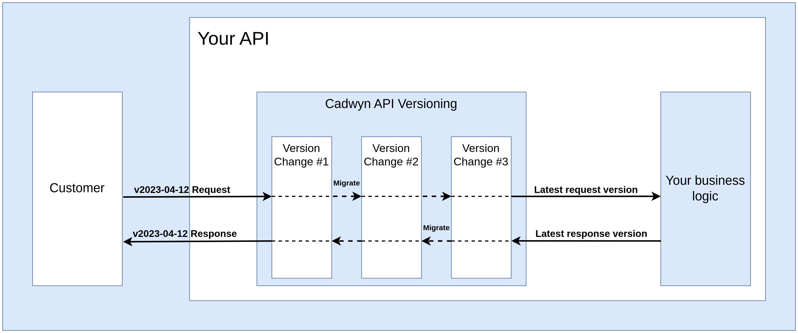

# Version Changes

Version changes are the backbone of Cadwyn. They allow to describe things like "this field in that schema had a different name in an older version" or "this endpoint did not exist in all earlier versions".

In Cadwyn, your business logic always works with a single version -- HEAD, which represents your latest version. This approach decouples your business logic from versioning and allows you to support hundreds of API versions using the same database models and business logic, while staying sane.

Follow these steps to add a new version:

1. Introduce a breaking change in your HEAD version
2. Apply reverse changes to older versions using special "migration instructions" so that your current users are not affected by the breaking changes

Migration instructions for reverting breaking changes should be grouped to simplify maintenance efforts. For example, renaming the `creation_date` field to `created_at` and deleting the `GET /v1/tax_ids` endpoint are unrelated changes and should be placed in separate groups. In contrast, deleting the `POST /v1/tax_ids` endpoint should be grouped with deleting the `GET /v1/tax_ids`. Such grouping makes the changes easier to understand for both your users and developers.

Each such group is called a **version change**:

```python
# versions/v2023_02_10.py

from cadwyn import VersionChange, endpoint


class RemoveTaxIdEndpoints(VersionChange):
    description = "Remove 'GET /v1/tax_ids' and 'POST /v1/tax_ids' endpoints"
    instructions_to_migrate_to_previous_version = (
        endpoint("/v1/tax_ids", ["GET", "POST"]).existed,
    )
```

After describing the groups, add your version change class(es) to your version bundle to activate them:

```python
# versions/__init__.py

from cadwyn import HeadVersion, Version, VersionBundle

from .v2023_02_10 import RemoveTaxIdEndpoints

versions = VersionBundle(
    HeadVersion(),
    Version("2023-02-10", RemoveTaxIdEndpoints),
    Version("2022-11-16"),
)
```

This instructs Cadwyn to **un**delete these endpoints in all versions before 2023-02-10.

The following explains what each part does and why:

## VersionBundle

`VersionBundle` is the single source of truth for your list of versions. It stores all versions and all [version changes](#version-changes) associated with them. Each version change represents a group of breaking changes. Each `Version` contains a group of version changes that led to its creation. For example, if you delete the `POST /v1/tax_ids` endpoint in version `2023-02-10`, you need to add a corresponding version change to the `2023-02-10` version. For example:

```python
# versions/__init__.py

from cadwyn import HeadVersion, Version, VersionBundle

from .v2023_02_10 import RemoveTaxIdEndpoints

versions = VersionBundle(
    HeadVersion(),
    Version("2023-02-10", RemoveTaxIdEndpoints),
    Version("2022-11-16"),
)
```

Did you notice that the initial version `2022-11-16` has no version changes? That is intentional. How could it have breaking changes if there were no prior versions?

## Version

`Version` is an ordered collection of version changes that describes when each version change happened allowing Cadwyn to generate schemas and routes for all versions correctly, based on which version changes are located in which versions.

### HeadVersion

Cadwyn has a special HEAD version: it is the only version you will create manually and use directly in your business logic. It is also the version used by Cadwyn to generate all other versions. When handling an HTTP request, Cadwyn first validates it against the appropriate API version, then Cadwyn applies all converters from the request's API version and up to the latest API version to it. Finally, Cadwyn converts the request to the appropriate schema from HEAD version (the schema that was used to generate the versioned schema from request's API version).

So Cadwyn migrates all requests from all versions to HEAD version to ensure that your business logic operates on a single version.

HEAD is very similar to your latest version but for a few key differences:

* Latest is user-facing while HEAD is only used internally by you and Cadwyn
* Latest is generated while HEAD is maintained by you manually
* Latest includes only the fields that API user is supposed to see while HEAD may include some fields missing from latest. For example, if an earlier version contained a field completely incompatible with latest, HEAD will still include it to ensure that older versions continue to function as before. This also applies to field types: if a field is required in latest but was nullable in an earlier version, then HEAD will keep it nullable to ensure that earlier version requests can easily be converted into HEAD requests.
* Latest can include constraints that are incompatible with older versions while HEAD can contain no constraints at all if you want -- the user-facing schemas are applied for validation before the request is converted to HEAD so HEAD does not need to re-validate anything if you do not want it to

## VersionChange

`VersionChange` classes describe each atomic group of business capabilities that you have altered in a version.

Note, however, that you only need to have a migration if it is a breaking change for your users. If you add a new endpoint or add a new field to your response schema, you do not need to have a migration for it because your users' code will not break. So by not having a migration you automatically add this change to all versions.

### VersionChange.\_\_name\_\_

The name of a version change, for example `RemoveTaxIdEndpoints`, describes what breaking change has happened. It must be a verb and it is the best clue for your new developers to quickly understand what happened between the versions. Feel free to use long names: it is better to have a long name than a name that fails to convey what exactly happened. Better have a voluminous name such as `RenameCreationDatetimeAndUpdateDatetimeToCreatedAtAndUpdatedAt` than to have a generic name such as `RefactorFields`. Because after just a few of such version changes your versioning structure can become completely unreadable:

```python
versions = VersionBundle(
    Version("2023-05-09", ChangeCreateLogic, AddRequiredFields),
    Version("2023-04-02", DeleteEndpoint, ChangeFields, RenameFields),
    Version("2023-02-10", RenameEndpoints, RefactorFields),
    Version("2022-11-16"),
)
```

### VersionChange.description

The description field of your version change must be even more detailed. In fact, it is intended to be the **name** and the **summary** of the version change for your clients. It must clearly state to you clients **what happened** and **why**. So you need to make it grammatically correct, detailed, specific, and written for humans. Note that you do not have to use a strict machine-readable format -- it is a portion of documentation, not a set of instructions. Have a look at [Stripe's description](https://stripe.com/blog/api-versioning) of one of their version changes as an example:

```md
Event objects (and webhooks) will now render a `request` subobject that contains a request Id and idempotency key instead of a string request Id.
```

It is concise, descriptive, and human-readable -- like any good piece of documentation. Now compare it with a less helpful description:

```md
Migration from first version (2022-11-16) to 2023-09-01 version.
Changes:
* Changed schema for `POST /v1/tax_ids` endpoint
```

* Its first line, `Migration from first version (2022-11-16) to 2023-09-01 version.`, duplicates the already-known information -- your developers will know which version `VersionChange` migrates to and from by its location in [VersionBundle](#versionbundle) and most likely by its file name. So it is redundant information
* Its second line, `Changes:`, does not provide useful information either because description of a `VersionChange` cannot describe anything but changes. So again, it is redundant information
* Its third line, `Changed schema for 'POST /v1/tax_ids' endpoint`, gives both too much and too little information. It states changing of a schema but it does not mention what exactly was changed. The goal is to make it easy for our clients to migrate from one version to another. The recommended description here is to mention the OpenAPI model name that you changed, the fields you changed, and why you changed them

### VersionChange.instructions_to_migrate_to_previous_version

In Cadwyn, you use the latest version. This attribute is a way for you to describe how your schemas and endpoints looked in previous versions so that Cadwyn can guess schema and route generation to recreate the old schemas and endpoints for your clients. So you only need to maintain your head (latest) schemas and your migrations while Cadwyn takes care of the rest. In fact, you spend minimal effort on **maintaining** your migrations because they are effectively immutable -- they describe the breaking changes that happened in the past so there is no need to ever change them.

This approach of *maintaining the present and describing the past* might appear weird. You just need to form the correct mindset which is counter-intuitive at first but after one or two attempts at versioning you will see how much sense this approach makes.

Imagine you need to know what your code looked like two weeks ago. You would use `git checkout` or `git reset` with an older commit because `git` stores the latest version of your code (which is also called HEAD) and the diffs between it and each previous version as a chain of changes. This is how Cadwyn works. Cadwyn stores the latest version and uses the diffs to regenerate the older versions.

<details>
  <summary>Note to curious readers</summary>

  Git doesn't actually work this way internally. My description is closer to how SVN works. It is just a simple metaphor to explain a concept.
</details>

### Data migrations

Suppose you rename the field `creation_date` to `created_at`. You have altered your schemas — that's great! But when your clients send you requests using the old versions of the API, you will still receive data where `creation_date` is used instead of `created_at`. How do you handle this? Well, in Cadwyn your business logic never receives requests of the old versions. Instead, it receives only the requests of the latest version. So when you define a version change that renames a field, you need to also define how to convert the request body from the old version to the newer version. For example:

```python
from cadwyn import (
    RequestInfo,
    VersionChange,
    convert_request_to_next_version_for,
    schema,
)
from invoices import InvoiceCreateRequest


class RemoveTaxIdEndpoints(VersionChange):
    description = "Rename 'Invoice.creation_date' to 'Invoice.created_at'."
    instructions_to_migrate_to_previous_version = (
        schema(InvoiceCreateRequest)
        .field("creation_date")
        .had(name="created_at"),
    )

    @convert_request_to_next_version_for(InvoiceCreateRequest)
    def rename_creation_date_to_created_at(request: RequestInfo):
        request.body["created_at"] = request.body.pop("creation_date")
```

Did you notice how the schema for `InvoiceCreateRequest` is specified in our migration? This signals Cadwyn to apply it to all routes with this schema as their body.

Now you have not only described how schemas changed but you have also described how to migrate a request of the old version to the new version. When Cadwyn receives a request targeting a particular version, the request is first validated against the schema of that particular version. Then Cadwyn applies all request migrations until the latest version to migrate the request to latest. So now your business logic receives the latest version of the request yet for your clients you have two versions of your API -- you have added variability without introducing any complexity to your business logic.

But wait... What happens to the `Invoice` responses? Your business logic will now return `created_at` so your clients from old versions will be affected. Cadwyn has a tool for that too: you migrate your responses as well. Requests were migrated forward in versions while responses are migrated backward in versions. So your business logic returns a response of the latest version and Cadwyn will use your response migrations to migrate it back to the version of your client's request:

```python
from cadwyn import (
    RequestInfo,
    ResponseInfo,
    VersionChange,
    convert_request_to_next_version_for,
    convert_response_to_previous_version_for,
    schema,
)
from invoices import (
    BaseInvoice,
    InvoiceCreateRequest,
    InvoiceResource,
)


class RemoveTaxIdEndpoints(VersionChange):
    description = "Rename 'Invoice.creation_date' to 'Invoice.created_at'."
    instructions_to_migrate_to_previous_version = (
        schema(BaseInvoice).field("creation_date").had(name="created_at"),
    )

    @convert_request_to_next_version_for(InvoiceCreateRequest)
    def rename_creation_date_to_created_at(request: RequestInfo):
        request.body["created_at"] = request.body.pop("creation_date")

    @convert_response_to_previous_version_for(InvoiceResource)
    def rename_created_at_to_creation_date(response: ResponseInfo):
        response.body["creation_date"] = response.body.pop("created_at")
```

Did you notice how the schema for `InvoiceResource` is specified in the migration above? This signals Cadwyn to apply it to all routes with this schema as their `response_model`. Also notice that `BaseInvoice` is now used in the instructions -- imagine it is the parent of both `InvoiceCreateRequest` and `InvoiceResource` so renaming it there will rename it in these schemas as well. You can, however, apply the instructions to both individual schemas instead of their parent if you want to.

Now our request comes, Cadwyn migrates it to the latest version using our request migration, then you do your business logic, return the latest response from it, and Cadwyn migrates it back to the request version. Does your business logic or database know that you have two versions? No, not at all. It is zero-cost. Consider the benefits of supporting not just two, but two hundred versions.



**Notice** how the **latest** versions of our schemas are used in our migration -- this pattern can be found everywhere in Cadwyn. The latest version of your schemas is used to describe what happened to all other versions because other versions might not exist when you are defining migrations for them.

#### Path-based migration specification

Often you need to migrate based on the endpoint path rather than the request body or response model. This happens when, for example, endpoint does not have a request body or its response model is used in other places that you do not want to migrate. Consider the example [above](#data-migrations), but use paths instead of schemas:

```python
from cadwyn import (
    RequestInfo,
    ResponseInfo,
    VersionChange,
    convert_request_to_next_version_for,
    convert_response_to_previous_version_for,
    schema,
)
from invoices import BaseInvoice


class RemoveTaxIdEndpoints(VersionChange):
    description = "Rename 'Invoice.creation_date' to 'Invoice.created_at'."
    instructions_to_migrate_to_previous_version = (
        schema(BaseInvoice).field("creation_date").had(name="created_at"),
    )

    @convert_request_to_next_version_for("/v1/invoices", ["POST"])
    def rename_creation_date_to_created_at(request: RequestInfo):
        request.body["created_at"] = request.body.pop("creation_date")

    @convert_response_to_previous_version_for("/v1/invoices", ["GET"])
    def rename_created_at_to_creation_date(response: ResponseInfo):
        response.body["creation_date"] = response.body.pop("created_at")
```

Though I highly recommend you to stick to schemas as it is much easier to introduce inconsistencies when using paths; for example, when you have 10 endpoints with the same response body schema but you forgot to add migrations for 3 of them because you use paths instead of schemas.

#### Migration of HTTP errors

Often you need to raise `fastapi.HTTPException` in your code to signal some errors to your users. However, if you want to change the status code of some error, it would be a breaking change because your error status codes and sometimes even their bodies are a part of your API contract.

By default, Cadwyn's response migrations do not handle errors but you can use the `migrate_http_errors` keyword argument to enable it:

```python
from cadwyn import (
    ResponseInfo,
    VersionChange,
    convert_response_to_previous_version_for,
)


class RemoveTaxIdEndpoints(VersionChange):
    description = "Replace status code 400 with 404 in 'GET /v1/invoices' if invoice is not found"
    instructions_to_migrate_to_previous_version = ()

    @convert_response_to_previous_version_for(
        "/v1/invoices", ["GET"], migrate_http_errors=True
    )
    def replace_400_with_404(response: ResponseInfo):
        if response.status_code == 400:
            response.status_code = 404
```

#### Migration of non-body attributes

Cadwyn can migrate more than just request bodies.

`RequestInfo` has the following interfaces to migrate requests:

* `body: Any`
* `headers: starlette.datastructures.MutableHeaders`
* `cookies: dict[str, str]`
* `query_params: dict[str, str]`

`ResponseInfo` has the the following interfaces to migrate responses:

* `body: Any`
* `status_code: int`
* `headers: starlette.datastructures.MutableHeaders`
* [set_cookie](https://www.starlette.io/responses/#set-cookie)
* [delete_cookie](https://www.starlette.io/responses/#delete-cookie)

#### Internal representations

So far, only simple cases were reviewed above. But what happens when you cannot migrate your data that easily? It can happen because your earlier versions had **more data** than your newer versions. Or that data had more formats.

Suppose that previously the `User` schema had a list of addresses but now you want to make a breaking change and turn them into a single address. The naive migration will take the first address from the list for requests and turn that address into a list for responses like this:

```python
from cadwyn import (
    RequestInfo,
    ResponseInfo,
    VersionChange,
    convert_request_to_next_version_for,
    convert_response_to_previous_version_for,
    schema,
)
from users import BaseUser


# THIS IS AN EXAMPLE OF A POOR MIGRATION
class RemoveTaxIdEndpoints(VersionChange):
    description = "Users now have 'address' field instead of 'addresses'"
    instructions_to_migrate_to_previous_version = (
        schema(BaseUser).field("address").didnt_exist,
        schema(BaseUser).field("addresses").existed_as(type=list[str]),
    )

    @convert_request_to_next_version_for(BaseUser)
    def turn_addresses_into_a_single_item(request: RequestInfo):
        addresses = request.body.pop("addresses")
        # The list could have been empty in the past so new "address"
        # field must be nullable.
        request.body["address"] = addresses[0] if addresses else None

    @convert_response_to_previous_version_for(BaseUser)
    def turn_address_into_a_list(response: ResponseInfo):
        response.body["addresses"] = [response.body.pop("address")]
```

But this will not work. If the user from the old version requests to save three addresses, only one will actually be saved. Old data is also going to be affected: if old users had multiple addresses, only one of them will be returned. This is important: a breaking change has been introduced.

In order to solve this issue, Cadwyn uses a concept of **internal representations**. An internal representation of your data is like a database entry of your data -- it is its **latest** version plus all the fields that are incompatible with the latest API version. If we were talking about classes, then internal representation would be a child of your latest schemas -- it has all the same data and a little more, it expands its functionality. Essentially your internal representation of user object can contain much more data than your latest schemas.

So all your requests get migrated to HEAD, which is the internal representation of latest -- but not the latest itself. Its data is very similar to latest. The same applies to your responses: you do not respond with and migrate from the latest version of your data, instead, you use its **internal representation** which is pretty close to the actual latest schemas.

In responses, returning the internal representation is simple: return your database model or a dict with everything you need for all your versions. In the user address example, it is recommended to continue storing the list of addresses in the database and add a single address to a response. The latest schemas will strip it while older schemas will be able to use it.

```python
# in your business logic

return {"address": user.addresses[0] if user.addresses else None, **user}
```

So now your migration will look like the following:

```python
from cadwyn import VersionChange, schema
from users import User


class RemoveTaxIdEndpoints(VersionChange):
    description = "Users now have 'address' field instead of 'addresses'"
    instructions_to_migrate_to_previous_version = (
        schema(User).field("address").didnt_exist,
        schema(User).field("addresses").existed_as(type=list[str]),
    )
```

Yes, you do not need any of the migrations anymore because responses are handled automatically. See the how-to section for an example of achieving the same result with requests.

#### Manual body migrations

Often you will need to migrate your data outside of routing, manually. For example, when you need to send a versioned response to your client via webhook or inside a worker/cronjob. In these instances, you can use `cadwyn.VersionBundle.migrate_response_body`:

```python
from users import UserResource
from versions import version_bundle

body_from_2000_01_01 = version_bundle.migrate_response_body(
    UserResource, latest_body={"name": "John"}, version="2000-01-01"
)
```

The returned `body_from_2000_01_01` is your data passed through all converters (similar to how it would when a response is returned from your route) and wrapped into `data.v2000_01_01.UserResource`. Because it is wrapped, you can include Pydantic’s defaults.

#### StreamingResponse and FileResponse migrations

Migrations for the bodies of `fastapi.responses.StreamingResponse` and `fastapi.responses.FileResponse` are not directly supported yet ([1](https://github.com/zmievsa/cadwyn/issues/125), [2](https://github.com/zmievsa/cadwyn/issues/126)). However, you can use `ResponseInfo._response` attribute to get access to the original `StreamingResponse` or `FileResponse` and modify it in any way you wish within your migrations.

## Pydantic RootModel migration warning

Pydantic has an implementation detail: `pydantic.RootModel` instances are memoized. So the following code is going to output `True`:

```python
from pydantic import RootModel
from users import User

BulkCreateUsersRequestBody = RootModel[list[User]]
BulkCreateUsersResponseBody = RootModel[list[User]]

print(BulkCreateUsersRequestBody is BulkCreateUsersResponseBody)  # True
```

A migration intended for only one of these schemas will automatically affect both. A recommended alternative is to either use subclassing:

```python
from pydantic import RootModel
from users import User

UserList = RootModel[list[User]]


class BulkCreateUsersRequestBody(UserList):
    pass


class BulkCreateUsersResponseBody(UserList):
    pass


print(BulkCreateUsersRequestBody is BulkCreateUsersResponseBody)  # False
```

or to specify migrations using [endpoint path](#path-based-migration-specification) instead of a schema.

## Dependency re-execution warning

Notice that whenever a request reaches Cadwyn, it is first validated against the request's version of the schema, then it is migrated to the latest version, and then validated again to prevent migrations from creating invalid requests.

This means that if you have a dependency that is executed during the request validation, **it will be executed twice**. For example, if you have a dependency that checks whether a user exists in the database, it will be executed twice. This is not an issue if the dependency is idempotent, but it becomes one if it is not.

To solve this issue, you can use the `cadwyn.current_dependency_solver` dependency which tells you whether your dependency is called before or after the request is migrated. If you want to run it when Cadwyn has migrated the request to the latest version, make sure that `current_dependency_solver` is `"cadwyn"`. If you want your dependency to run at the very beginning of handling the request, you should only run it when `current_dependency_solver` is `"fastapi"`.

```python
from cadwyn import current_dependency_solver


def my_dependency(
    dependency_solver: Annotated[
        Literal["fastapi", "cadwyn"], Depends(current_dependency_solver)
    ]
):
    if dependency_solver == "fastapi":  # Before migration
        ...
    else:  # After migration
        ...
```

but the majority of your dependencies will not need this as most dependencies should not have side effects or network calls within them.

## Version changes with side effects

Sometimes you will use API versioning to handle a breaking change in your **business logic**, not in the schemas themselves. In such cases, it is tempting to add a version check and just follow the new business logic such as:

```python
# This is wrong. Please do not do this.
if api_version_var.get() >= date(2022, 11, 11):
    # do new logic here
    ...
```

Instead, Cadwyn provides a special `VersionChangeWithSideEffects` class for handling such cases. It makes finding dangerous versions that have side effects much easier and provides a nice abstraction for checking whether you are on a version where these side effects have been applied.

As an example, let's use the tutorial section's case with the user and their address. Suppose you use an external service to check whether user's address is listed in it and return 400 response if it is not. Also suppose that you have only added this check in the newest version.

```python
from cadwyn import VersionChangeWithSideEffects


class UserAddressIsCheckedInExternalService(VersionChangeWithSideEffects):
    description = (
        "User's address is now checked against existence in an external service. "
        "If it is not found, a 400 code is returned."
    )
```

Then you will have the following check in your business logic:

```python
from src.versions import versions, UserAddressIsCheckedInExternalService


async def create_user(payload):
    if UserAddressIsCheckedInExternalService.is_applied:
        check_user_address_exists_in_an_external_service(payload.address)
    ...
```

So this change can be contained in any version. Your business logic doesn't know which version it has. And shouldn't.

### Warning against side effects

Side effects are a very powerful tool but they must be used with great caution. Are you sure you MUST change your business logic? Are you sure whatever you are trying to do cannot just be done by a migration? 90% of time, you will **not** need them. Please think twice before using them. API versioning is about having the same underlying app and data while changing the schemas and API endpoints to interact with it. By introducing side effects, you leak versioning into your business logic and possibly even your data which makes your code significantly harder to maintain in the long term. If each side effect adds a single `if` to your logic, then after 100 versions with side effects, you will have 100 more `if`s. If used correctly, Cadwyn helps you maintain decades’ worth of API versions with minimal maintenance effort, and side effects make it significantly harder to do. Changes in the underlying source, structure, or logic of your data should not affect your API or public-facing business logic.

However, the [following use cases](../how_to/change_business_logic/index.md) often necessitate side effects.
