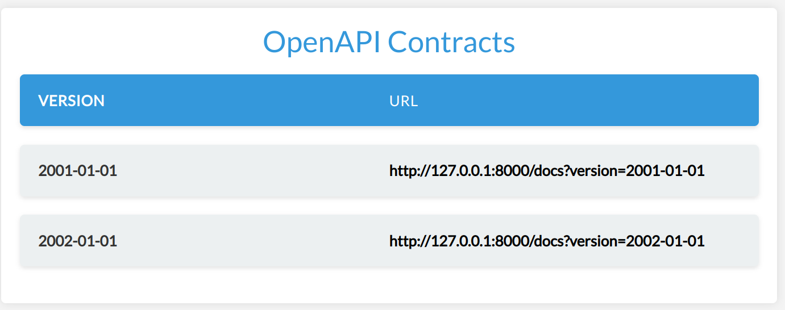

# Tutorial

This guide provides a step-by-step tutorial for setting up automatic API versioning using Cadwyn. I will illustrate this with an example of a User API, where we will be implementing changes to a User's address. You can also see the advanced version of the service from this tutorial [here](https://github.com/zmievsa/cadwyn/tree/main/tests/tutorial).

Adding a new API version in Cadwyn consists of two main steps:

1. Make the breaking change
2. Use Cadwyn to describe how to revert the breaking change

In this guide, we'll prepare an environment for working with Cadwyn effectively with a basic usage example, make a breaking change, and then show how Cadwyn can help us keep the old API versions untouched.

## Step 0: Setting up

Let's follow the steps we discussed before for versioning using Cadwyn.

Here is an initial API setup where the User has a single address. We will be implementing two routes - one for creating a user and another for retrieving user details. We'll be using "int" for ID for simplicity. Please note that we will use a dict in place of a database for simplicity of our examples but do not ever do it in real life.

The first API you come up with usually doesn't require more than one address -- why bother?

```python
{!> ../docs_src/quickstart/tutorial/block001.py !}
```

If we visit `/docs`, we will see the following dashboard:


The app is ready to be used. Every time you would like to call its endpoints, you just need to pass `X-API-VERSION` header with value equal to `2000-01-01`. But this is just one version. Let us see what happens when we need to make a breaking change.

## Step 1: Making the breaking change

During our development, we have realized that the initial API design was wrong and that addresses should have always been a list because the user wants to have multiple addresses to choose from so now we have to change the type of the "address" field to the list of strings.

```python hl_lines="2 4 15 20 30 39"
{!> ../docs_src/quickstart/tutorial/block002.py !}
```

Now every user of ours will now have their API integration broken. To prevent that, we have to introduce API versioning. There aren't many methods of doing that. Most of them force you to either duplicate your schemas, your endpoints, or your entire app instance. And it makes sense, really: duplication is the only way to make sure that you will not break old versions with your new versions; the bigger the piece you duplicating -- the safer. Of course, the safest being duplicating the entire app instance and even having a separate database. But that is expensive and makes it either impossible to make breaking changes often or to support many versions. As a result, either you need infinite resources, very long development cycles, or your users will need to often migrate from version to version.

Stripe has come up [with a solution](https://stripe.com/blog/api-versioning): let's have one HEAD app version whose responses get migrated to older versions and let's describe changes between these versions using migrations. This approach allows them to keep versions for **years** without dropping them. Obviously, each breaking change is still bad and each version still makes our system more complex and expensive, but their approach gives us a chance to minimize this complexity. Additionally, it allows us backport features and bugfixes to older versions. However, you will also be backporting bugs, which is a sad consequence of eliminating duplication.

Imagine you needed to know what your code looked like two weeks ago. You would use `git checkout` or `git reset` with an older commit because `git` stores the latest version of your code (which is also called HEAD) and the differences between it and each previous version as a chain of changes. This is exactly how Stripe's approach works! They store the latest version and use the diffs to regenerate the older versions.

Cadwyn builds upon approach so let's continue our tutorial and try to combine the two versions we created using versioning.

<details>
  <summary>Note to curious readers</summary>

  Git doesn't actually work this way internally. My description is closer to how SVN works. It's just a really simplistic metaphor to explain a concept.
</details>

## Step 2: Describing how to revert the breaking change

To fix the old integrations of our clients, we need to add back the `2000-01-01` version and its state. In Cadwyn, it is done using version changes (or, as Stripe calls them, version gates). You could also think of them as reverse database migrations (database migrations to downgrade to the previous state of the database). Essentially version changes describe the difference between the latest version and the previous version. They are a way to say "Okay, we have applied the breaking changes but here is how we would revert these changes for our old clients".

For every endpoint whose `response_model` is `UserResource`, this migration will convert the list of addresses back to a single address when migrating to the previous version. Our goal is to have an app of [HEAD version](../concepts/version_changes.md#headversion) and to describe what older versions looked like in comparison to it. That way the old versions are frozen in migrations and you can **almost** safely forget about them.

```python hl_lines="8-9 12 14-16 45-66"
{!> ../docs_src/quickstart/tutorial/block003.py !}
```

See how we are popping the first address from the list? This is only guaranteed to be possible because we specified earlier that `min_length` for `addresses` must be `1`. If we didn't, then the user would be able to create a user in a newer version that would be impossible to represent in the older version. I.e. If anyone tried to get that user from the older version, they would get a `ResponseValidationError` because the user wouldn't have data for a mandatory `address` field. You need to always keep in mind that API versioning is only for versioning your **API**, your interface. Your versions must still be completely compatible in terms of data. If they are not, then you are versioning your data and you should really go with a separate app instance. Otherwise, your users will have a hard time migrating back and forth between API versions and so many unexpected errors.

See how we added a migration not only for response but also for request? This will allow our business logic to stay completely the same, no matter which version it was called from. Cadwyn will always give your business logic the request model from the HEAD version by wrapping each request in it.

Let's run our app and take a look at the generated dashboard and openapi schemas:




The endpoint above is from the `2000-01-01` version. As you see, our routes and business logic are for the HEAD version but our openapi has all information about all API versions which is the main goal of Cadwyn: a large number of long-living API versions without placing any burden on your business logic.

Obviously, this was just a simple example and cadwyn has a lot more features so if you're interested -- take a look at the [how-to](../how_to/index.md) and [concepts](../concepts/index.md) sections.
